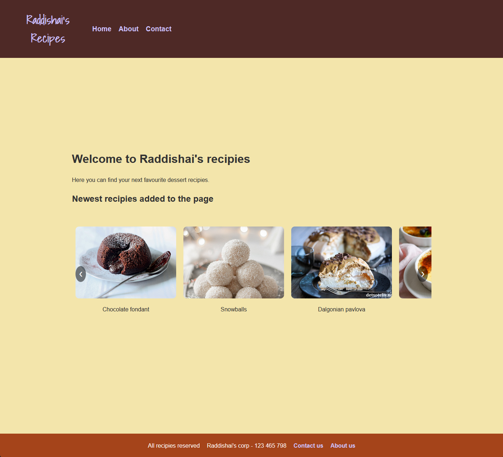

# Cross Course Project

---



## Description
This project was the first exam of the first year of the Noroff vocational school.
We were supposed to set up an external API using wordpress, import it and create product spesific pages dynamically. 

---

## Built With
- HTML
- CSS
- JavaScript

---

## Live Demo
You can view the live portfolio [here](https://blogofraddishai.netlify.app/).

---

## Installation
To run the project locally:
git clone https://github.com/RaddishAI/blog.raddishai.git

1. Clone the repository:
   ```bash
   git clone https://github.com/RaddishAI/blog.raddishai.git

---

## Contact Me

- [LinkedIn](https://www.linkedin.com/in/petter-r%C3%B8nning-80602613a/)
- [Portfolio](https://raddishaisportfolio.netlify.app/)
- [Email](mailto:petter.arbeid@gmail.com)

---
